<div align="center">


# ✨ Full-Stack Todo List Application

*Seamlessly organize your life with our modern, cloud-ready task management solution*

[](https://www.docker.com/)
[](https://reactjs.org/)
[](https://nodejs.org/)
[](https://www.mongodb.com/)

---

</div>

## 🎯 What This Repository Delivers

This repository **hosts** a full-stack Todo List application designed to allow users to create, manage, and organize their tasks efficiently. The application features a **React-based frontend** and a **Node.js** backend, utilizing **MongoDB** for data persistence.

<details>
<summary>🌟 <strong>Key Features</strong></summary>

- **Lightning-fast task creation** and management
- **Real-time updates** across all your devices  
- **Cloud-ready architecture** with Docker containerization
- **Scalable MongoDB** database for unlimited tasks
- **Modern React UI** with responsive design
- **Production-ready** with comprehensive health checks

</details>

---

## 🚀 Quick Start Guide

### 📋 Prerequisites

Before diving in, ensure you have these essentials:

> **Required Tools:**
> - 🐳 **Docker** & **Docker Compose** installed ([Get Docker](https://docs.docker.com/get-docker/))
> - 🔓 **Available ports:** `3000`, `27017`, and `80`

---

### ⚡ Launch Your App in 3 Steps

<table>
<tr>
<td width="50px">1️⃣</td>
<td>

**Navigate to your project**
```bash
cd /home/ioenimil/ENIMIL-DISK/Software Engineering/Projects/Azubi/fullstack-todo-list
```

</td>
</tr>
<tr>
<td>2️⃣</td>
<td>

**Build & launch everything**
```bash
docker compose up --build
```
*Grab a coffee ☕ while Docker works its magic!*

</td>
</tr>
<tr>
<td>3️⃣</td>
<td>

**Access your running services**
- 🌐 **Frontend:** [http://localhost](http://localhost) ← *Your main app*
- 🔧 **Backend API:** [http://localhost:3000](http://localhost:3000)
- 🗄️ **MongoDB:** `mongodb://mongo:27017/` *(internal)*

</td>
</tr>
</table>

### 🧪 Verify Everything Works

Run our automated health check:
```bash
chmod +x test_containers.sh
./test_containers.sh
```

> 💡 **Pro Tip:** This script tests all three services and gives you instant feedback on your setup!

---

## 🏗️ Architecture Overview

```mermaid
graph TB
    User([👤 User]) --> Frontend[🌐 React Frontend<br/>Port 80]
    Frontend --> Backend[⚙️ Node.js API<br/>Port 3000]
    Backend --> Database[(🗄️ MongoDB<br/>Port 27017)]
    
    subgraph "Docker Network: azubi-africa-app-network"
        Frontend
        Backend  
        Database
    end
    
    style Frontend fill:#61DAFB,stroke:#333,stroke-width:2px,color:#000
    style Backend fill:#339933,stroke:#333,stroke-width:2px,color:#fff
    style Database fill:#47A248,stroke:#333,stroke-width:2px,color:#fff
```

<div align="center">



</div>

### 🏷️ Container Configuration

| Component | Container Name | Port | Purpose |
|-----------|----------------|------|---------|
| 🌐 **Frontend** | `azubi-africa-frontend` | `80` | React UI serving your users |
| ⚙️ **Backend** | `azubi-africa-backend` | `3000` | REST API handling business logic |
| 🗄️ **Database** | `azubi-africa-mongodb` | `27017` | Data persistence & retrieval |

---

## ⚙️ Configuration Details

<details>
<summary>🔧 <strong>Environment Variables</strong></summary>

### Backend Configuration
```env
MONGO_URI=mongodb://mongo:27017/todoapp
NODE_ENV=production
PORT=3000
```

### Frontend Configuration  
```env
VITE_APP_BACKEND_URL=http://localhost:3000
```

</details>

<details>
<summary>🔒 <strong>Security Features</strong></summary>

- **Auto-restart** containers for high availability
- **Environment-based** configuration management
- **Network isolation** with custom Docker networks
- **Health checks** for all critical services

</details>

---

## 🛠️ Troubleshooting Hub

### 🩺 Quick Health Check

Having issues? Start here:
```bash
./test_containers.sh
```

### 🔍 Common Issues & Solutions

<details>
<summary>🚫 <strong>Containers won't start</strong></summary>

**Check these first:**
```bash
# Verify Docker is running
docker --version

# Check for port conflicts  
netstat -tlnp | grep -E "(3000|27017|80)"

# View detailed logs
docker compose logs
```

</details>

<details>
<summary>⚠️ <strong>Backend API failing</strong></summary>

**Debug steps:**
```bash
# Check backend logs
docker logs azubi-africa-backend

# Test API directly
curl http://localhost:3000/todos

# Verify container health
docker ps --filter "name=backend"
```

</details>

<details>
<summary>🌐 <strong>Frontend not loading</strong></summary>

**Troubleshoot frontend:**
```bash
# Test frontend accessibility
curl -I http://localhost:80

# Check if backend is reachable
curl http://localhost:3000/health

# View frontend logs
docker logs azubi-africa-frontend
```

</details>

<details>
<summary>🗄️ <strong>Database connection problems</strong></summary>

**MongoDB diagnostics:**
```bash
# Check MongoDB logs
docker logs azubi-africa-mongodb

# Test database port
nc -zv localhost 27017

# Verify network connectivity
docker network ls | grep azubi
```

</details>

---

## 🛑 Stopping the Application

When you're done working:
```bash
docker-compose down
```

*This gracefully stops all containers and preserves your data.*

---

<div align="center">

## 💝 Built With Love

*This repo modern containerized deployment.*

**Tech Stack:** React • Node.js • MongoDB • Docker • Docker Compose

---

*Made by Isaac Obo Enimil 🚀*

</div>